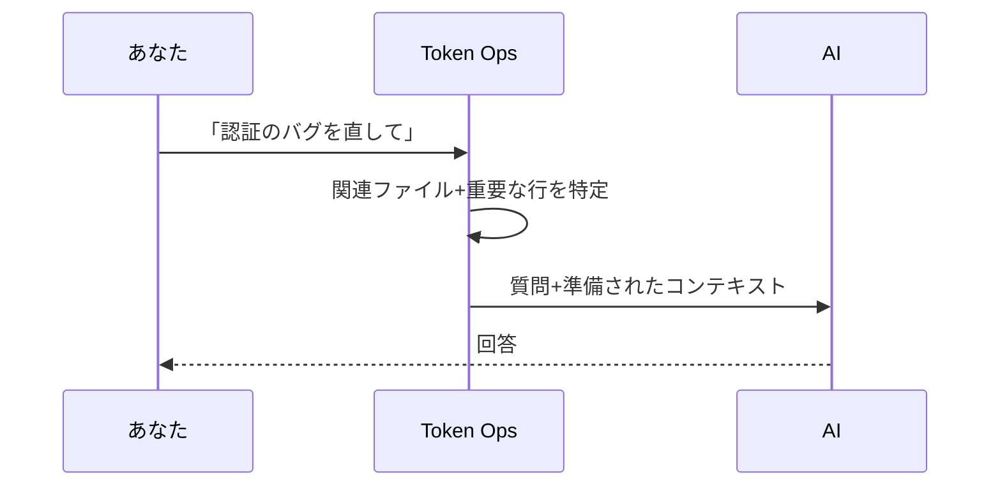
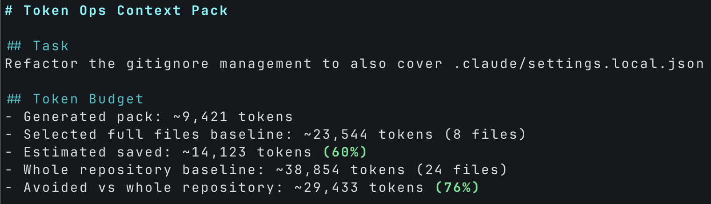
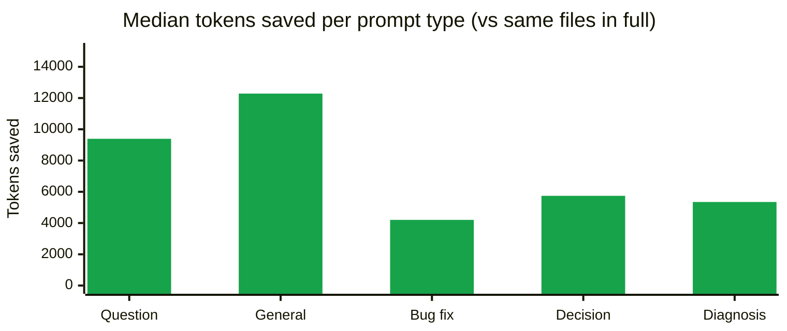
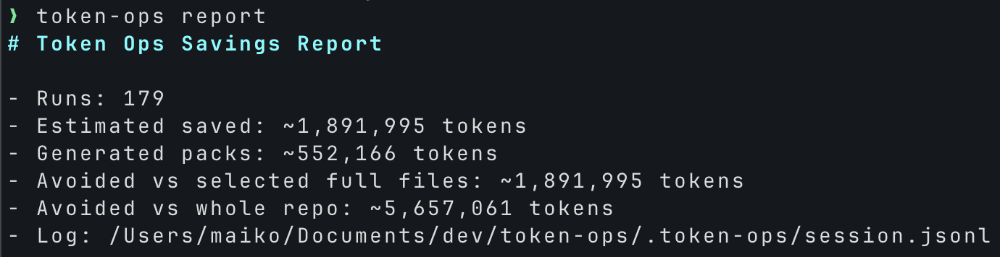

# Token Ops

**English**: [README.md](README.md)

バイブコーディングしていると、AIが毎回リポジトリを探り回ってトークンを消費します。Token Opsはこの無駄を削減します。Cursor・Claude Code・CodexなどMCP対応エージェントが幅広くファイルを読み始める前に、タスクに特化したコンパクトな関連コンテキストを渡し、節約したトークン数のレポートを記録します。

一度インストールすれば、あとは普段通りコーディングするだけ。エージェントがどれだけ無駄な読み込みを避けたかが見えます。APIキー不要、アカウント不要、クラウドバックエンド不要、デフォルトで使用状況の外部送信なし。

## 仕組み

普段、AIアシスタントにコードについて質問すると、AIはまずリポジトリを探り回ります。ファイルを開き、キーワードを検索し、さらに読み込む。その探索でトークンを消費します。

Token Opsはその探索を**前もって**実行します。質問を送るたびに:

1. プロジェクトのファイル一覧を確認
2. その質問に最も関係しそうなファイルを選ぶ
3. 関連する行だけを抽出

それらを質問と一緒にAIに渡します。AIは最初から必要な情報を持つので、探索の必要がありません。



回答品質は同じ、トークンは少なめ。パックで足りなければAIは普通通りもっとファイルを読めます(ブロックはしません)。

## 実測の節約効果

実例:



- このプロジェクト履歴全体のトークン数: **~288,000 → ~71,000**(4倍コンパクト)
- 節約量: **~217,000トークン** ≈ **$0.65(Sonnet 4.5)** / **$3.25(Opus 4.7)**

### プロンプトタイプ別

プロンプトの種類別にどれくらい削減できたかを示しています(プロンプト本文は非公開)。



| プロンプトタイプ | パック中央値 | 節約中央値 |
|---|---|---|
| 質問・確認 | ~2,967トークン | ~9,392トークン |
| 全般的なコメント・フィードバック | ~3,789トークン | ~12,285トークン |
| バグ修正・タスク依頼 | ~906トークン | ~4,202トークン |
| 判断・確認 | ~2,032トークン | ~5,742トークン |
| 診断(ログ貼付) | ~2,926トークン | ~5,348トークン |

生のパック出力例が[docs/sample-pack.md](docs/sample-pack.md)にコミットされているので、Token Opsが何を出力するかが正確に確認できます。

### この数値が意味するもの

- **上限値であって保証ではありません。** パック到着後もAIはファイルを追加で読むかもしれません。実際の節約はこの数値以下、多くの場合より少なくなります。
- **概算値です。** トークン数は文字長から推定しています。プロンプトタイプ別の数値はサンプルサイズが小さいので、個別の値より集計値を信頼してください。
- **品質は損なわれません。** Token Opsは会話に**コンテキストを追加するだけ**。AIのツールはそのまま使えるので、パックがカバーしていなければさらにファイルを読めます。

## クイックスタート

> **前提:** git がインストール済み、かつプロジェクトが git repo として初期化済み(まだなら `git init`)。リモート不要。

> 💡 **最も簡単: AIに任せる。** Claude Code・Cursor・シェルアクセスを持つAIツールに以下を貼り付けてください:
> `このプロジェクトにToken Opsをインストールして: https://github.com/maikoo811/token-ops`
>
> AIがこのREADMEを読んでインストールを実行してくれます。うまくいかない場合は以下の手動手順を参照してください。

### 1. CLIをインストール

```sh
npm install -g token-ops
```

### 2. プロジェクトにToken Opsを組み込む

```sh
cd /path/to/your-project
token-ops install
```

デフォルトではClaude Code・Cursor・Codexのフック・ルールをすべてインストールします。1つだけにする場合:

- `token-ops install claude-hook`: Claude Codeフックのみ
- `token-ops install cursor`: Cursorルールのみ
- `token-ops install codex`: Codex `AGENTS.md`のみ

`claude-hook`に`--trigger-mode smart`を付けると、コーディング系キーワードを含むプロンプトのみで発火します(デフォルトは6文字以上のどのプロンプトでも発火)。

### グローバルインストール(任意)

`--global`を付けるとホーム配下(`~/.claude/`、`~/.cursor/`)にインストールされ、全プロジェクトでToken Opsが発火します。プロジェクトごとのインストールが不要になります。

```sh
token-ops install --global
token-ops install claude-hook --global
```

Codex(AGENTS.md)はプロジェクト単位のみです。Cursor User Rulesは手動でのペーストが必要で、コマンドがペースト用のテキストを出力します。

### Claude CodeでMCPツールを使えるようにする(任意)

Claude Codeから「これまでどれくらいトークン節約できた?」と聞いて答えさせたり、Token Opsのツールを直接呼べるようにします。1回だけ登録:

```sh
claude mcp add token-ops token-ops-mcp
```

`claude mcp list`で確認、`claude mcp remove token-ops`で解除。

### 3. エディタを再起動

Claude Code・Cursorなどのエディタは起動時にフック・MCPの設定を読み込みます。エディタを完全終了(macOSなら`Cmd+Q`)してからプロジェクトを開き直してください。

### 4. 動作確認

普段通りエディタを使ってください。コーディング系のプロンプト(`fix...`、`refactor...`、`バグ...`など)を数件試した後、以下を実行:

```sh
token-ops report
```

`Runs: N`のNが0より大きければ発火しています。



またはチャットでAIに直接聞いても見られます:

> 「Token Opsでこれまでどれくらいトークン節約できた?」

### アンインストール

```sh
token-ops uninstall
token-ops uninstall --global
```

`install`が追加した内容のみを削除します。それ以外の設定は保持されます。

## 詳細な節約分析

`token-ops report`(上記「動作確認」で扱いました)は集計数値を返します。プロンプトタイプ別の内訳や、Claude API価格に基づくドル換算節約額を見るには:

```sh
node /path/to/token-ops/docs/session-stats.mjs
```

出力例:

```
## Aggregate

- Hook firings: 35
- Generated packs: ~97,000 tokens
- Equivalent full reads of the same ranked files: ~406,000 tokens
- Avoided: ~309,000 tokens
- Approx Sonnet 4.5 input cost saved: ~$0.93
- Approx Opus 4.7 input cost saved: ~$4.63

## By prompt type (median per firing)
| Prompt type | Median pack | Median saved |
|---|---|---|
| Question / clarification | ~2,967 tokens | ~9,392 tokens |
| ... |
```

このスクリプトは依存ゼロのNode 18+で動きます。既知のテストフィクスチャプロンプト(`npm test`実行時のもの)を除外しているので、開発中のテスト実行が集計値を汚染しません。書き込みは行わず、読み取り専用です。

## リファレンス

### 自動化レベル

エディタとセットアップの手間で選んでください:

| レベル | エディタ | セットアップ | プロンプト時の挙動 |
|---|---|---|---|
| **★★★★ 自動付加(フック)** | Claude Code | `token-ops install claude-hook` | フックが全プロンプトにコンパクトなパックを前置。モデルがツールをスキップしても効きます。 |
| **★★★ プラグイン** | Cursor (Marketplace) | ワンクリック(公開後) | エージェントに`build_compact_context`を最初に呼ぶよう指示。 |
| **★★ グローバルルール** | Cursor | `Settings → Rules → User Rules`にルールをペースト | ★★★と同じだがルール経由、全プロジェクトに適用。 |
| **★ プロジェクト別ルール** | Cursor | `token-ops install cursor` | ★★と同じだが1プロジェクトのみ。 |
| **手動** | 任意 | なし | チャットで`Use build_compact_context for: <task>`と入力。 |

### Cursorプラグイン

[Cursor Marketplace](https://cursor.com/marketplace)で配布。MCPサーバー、`build_compact_context`を最初に呼ぶルール、下記の4つのMCPツールを含みます。

### MCPツール

- `build_compact_context`: タスクに特化した小さな関連コンテキストを作成
- `estimate_context_cost`: 選択されたファイル群とリポジトリ全体のコンテキストコストを推定
- `list_high_cost_files`: コンテキスト投入時にコストが高い追跡対象ファイルを一覧化
- `report_saved_tokens`: ローカルの節約トークンレポートを表示

### Cursorグローバルルール(コピペ用)

レベル★★の場合、以下を`Cursor Settings → Rules → User Rules`にペーストしてください:

```
Before broad repository exploration, large file reads, or noisy test-log analysis, use Token Ops if its MCP tools are available.

Prefer this order:
1. Call build_compact_context for the current task.
2. Use the returned snippets and token budget before reading more files.
3. Call list_high_cost_files before opening large files, generated files, lockfiles, or logs.
4. Call report_saved_tokens when the user asks about cost, tokens, usage, or savings.

Avoid reading broad repository context until Token Ops output is insufficient for the task.
```

そして`~/.cursor/mcp.json`にToken OpsをMCPサーバーとして追加してください(初回のみ):

```json
{
  "mcpServers": {
    "token-ops": {
      "command": "/absolute/path/to/node",
      "args": ["/absolute/path/to/token-ops/mcp/server.js"]
    }
  }
}
```

> `node`は絶対パスを指定してください。Cursor GUIのサブプロセスはnvmの`PATH`を継承しません。

## 詳細設定

<details>
<summary>MCPサーバーを手動で組み込む</summary>

`token-ops install`を経由せずにToken Opsを登録したい場合:

```sh
token-ops-mcp
```

または直接サーバーファイルを実行:

```sh
node mcp/server.js
```

Cursor互換のローカルMCPテンプレート:

```json
{
  "mcpServers": {
    "token-ops": {
      "command": "node",
      "args": ["${workspaceFolder}/mcp/server.js"]
    }
  }
}
```

> nvm利用時は`node`の絶対パス指定を推奨。Cursor GUIのサブプロセスはシェルの`PATH`を継承しません。

</details>

## ロードマップ

- Cursor Marketplace審査メタデータ
- Cursorワンクリックインストールフロー
- 生成ファイル・ロックファイル・ログの事前読み取りガードポリシー
- trace-mcpに着想を得たコードグラフと影響分析
- Cursor・Codex・Claude Codeをまたぐマルチエージェント節約レポート
- 実測ベースの節約値(現状の数値は理論上限)
