# Token Ops

Token Ops reduces wasted context during AI coding sessions. It gives Cursor, Claude Code, Codex, and other MCP-compatible agents a compact task-focused context pack before they read broadly, then records an estimated saved-token report.

The product goal is simple: install once, vibe code normally, and see how much context the agent avoided.

## Measured Savings

Real numbers from running `token-ops pack` against this repository (17 tracked files, ~12,587 tokens of full-repo context):

```mermaid
---
config:
  xyChart:
    width: 760
    height: 360
  themeVariables:
    xyChart:
      plotColorPalette: "#4f46e5, #94a3b8, #cbd5e1"
---
xychart-beta
  title "Token cost per task — pack vs baselines (lower is better)"
  x-axis ["Fix JA tokenizer", "Add uninstall", "Build pack"]
  y-axis "Tokens" 0 --> 14000
  bar "Token Ops pack" [3959, 3076, 3859]
  bar "Selected files (full read)" [9078, 4588, 5369]
  bar "Whole repo (upper bound)" [12587, 12587, 12587]
```



| Task | Pack size | Vs selected full files | Vs whole repo |
|---|---|---|---|
| `Fix the Japanese keyword tokenizer in extractKeywords` | ~3,959 tokens | 56% smaller | 69% smaller |
| `Add an uninstall command to the CLI` | ~3,076 tokens | 33% smaller | 76% smaller |
| `Build a compact context pack for the current task` | ~3,859 tokens | 28% smaller | 69% smaller |

A raw verbatim pack output is checked in at [docs/sample-pack.md](docs/sample-pack.md) so you can see exactly what Token Ops produces.

### What "saved" actually measures

- **Pack size** is real bytes counted at `length / 4` (a rough token estimate).
- **Vs selected full files** compares the pack against reading the same ranked files in full.
- **Vs whole repo** compares against reading every tracked text file. This is an upper bound — a real agent wouldn't read everything, so treat this number as a ceiling, not a typical baseline.

What this does NOT measure: whether the pack contained the right context, or how many follow-up reads the agent makes. Token Ops earns its keep when its snippets are sufficient for the task; it does not stop the agent from reading more when needed.

### Verify these numbers yourself

Inside this repository:

```sh
npm install
npm test
node bin/token-ops.js pack "Fix the Japanese keyword tokenizer in extractKeywords"
```

The `## Token Budget` section of the output is the source of the table above.

## Beginner Defaults

Token Ops is designed to be useful without setup:

- No API key
- No account
- No cloud backend
- No telemetry by default
- Local MCP server
- Beginner defaults: 6 files, 80 snippet lines per file, auto language

## Cursor Plugin

Token Ops is being shaped for Cursor Marketplace distribution as a free local plugin.

The plugin includes:

- A local MCP server: `mcp/server.js`
- Cursor rules: `rules/token-ops.mdc`
- A Token Ops skill: `skills/token-ops/SKILL.md`
- Commands for compact context and saved-token reports

The MCP server runs locally. It does not require a hosted backend or a Token Ops account.

After installation, users can ask Cursor:

```text
Show my Token Ops savings report.
```

```text
Use Token Ops before changing this code.
```

```text
Which files are expensive for Cursor to read?
```

## MCP Tools

- `build_compact_context`: create a small task-focused context pack
- `estimate_context_cost`: estimate selected-file and whole-repo context cost
- `list_high_cost_files`: find tracked files that are expensive to put in context
- `report_saved_tokens`: show the local saved-token report

## CLI Install

From this repository:

```sh
npm install -g .
```

Or run without installing:

```sh
npx . pack "Fix the CSV import bug"
```

## CLI Usage

Inside any git project:

```sh
token-ops pack "Fix the CSV import bug"
```

Write the pack to a file:

```sh
token-ops pack "Improve auth error handling" -o context-pack.md
```

Show the saved-token report:

```sh
token-ops report
```

Find large tracked text files:

```sh
token-ops high-cost-files --limit 12
```

Estimate context cost for a task:

```sh
token-ops cost "Add tests for billing webhooks"
```

## One-command Editor Setup

Install project-local helpers:

```sh
token-ops install
```

This creates:

- `.claude/skills/token-ops/SKILL.md`
- `.claude/settings.local.json`
- `.cursor/rules/token-ops.mdc`
- `AGENTS.md`

Install only one integration:

```sh
token-ops install claude
token-ops install claude-hook
token-ops install cursor
token-ops install codex
```

## Local MCP Server

For advanced users who want to wire Token Ops manually:

```sh
token-ops-mcp
```

The package also exposes the server at:

```sh
node mcp/server.js
```

Cursor-compatible local MCP template:

```json
{
  "mcpServers": {
    "token-ops": {
      "command": "node",
      "args": ["${workspaceFolder}/mcp/server.js"]
    }
  }
}
```

## What It Includes

Each context pack includes:

- Git branch and changed files
- Relevant files selected from task keywords
- Snippets around keyword matches
- Rough token estimates
- Estimated saved tokens versus selected full files and whole-repo context

## Roadmap

- Cursor Marketplace review metadata
- One-click Cursor installation flow
- Pre-read guard policies for generated files, lockfiles, and logs
- Code graph and impact analysis inspired by trace-mcp
- Multi-agent savings reports across Cursor, Codex, and Claude Code
