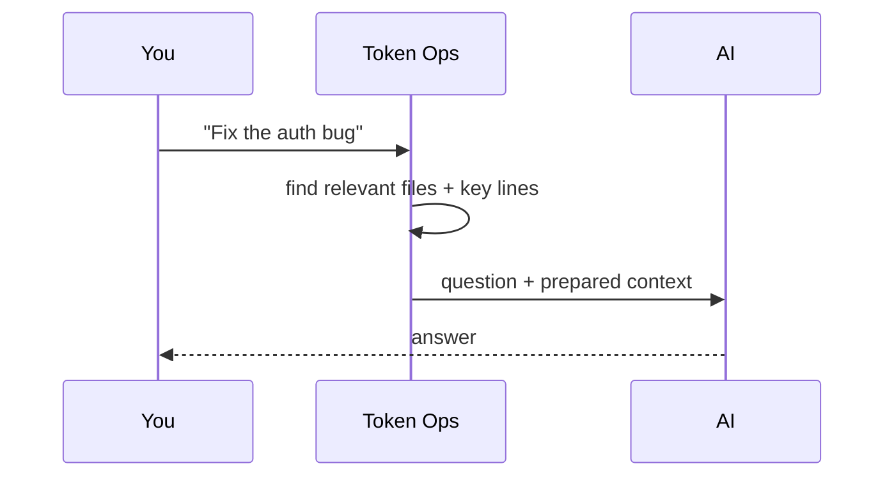
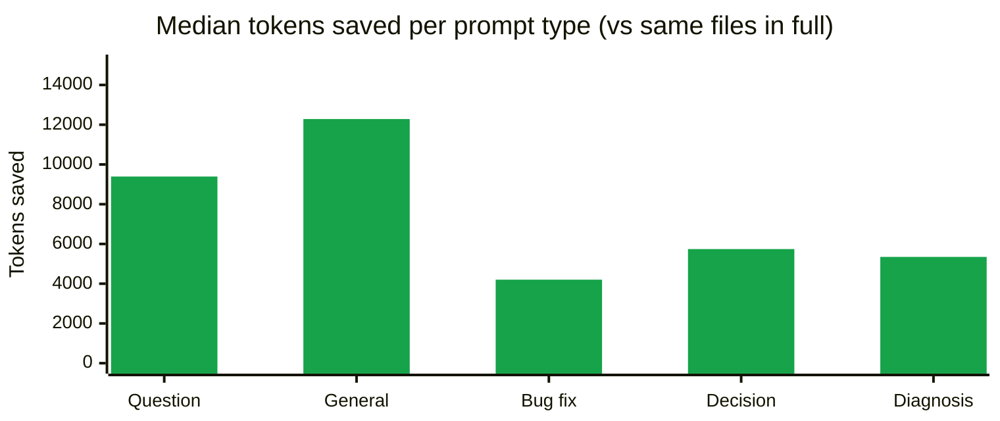

# Token Ops

Token Ops reduces wasted context during AI coding sessions. It gives Cursor, Claude Code, Codex, and other MCP-compatible agents a compact task-focused context pack before they read broadly, then records an estimated saved-token report.

The product goal is simple: install once, vibe code normally, and see how much context the agent avoided. No API key, no account, no cloud backend, no telemetry by default.

## How it works

When you ask an AI assistant about your code, it usually has to dig around your repo first — opening files, searching for keywords, reading more — before it can answer. That digging eats tokens.

Token Ops does the digging up front. Every time you send a question:

1. It looks at your project files
2. Picks the ones most likely to matter for your question
3. Pulls out just the relevant lines

Then it hands those to the AI together with your question. The AI gets what it needs from the start — no wandering.



Same answer quality, fewer tokens. If the prepared context isn't enough, the AI can still look around — Token Ops only adds; it never blocks.

## Measured Savings

These numbers are real — we measured them while building this project itself with Token Ops running. You can reproduce them on your own machine with [`docs/session-stats.mjs`](docs/session-stats.mjs) (zero dependencies).

If the AI had read the relevant files in full, it would have used **~288,000 tokens**. Token Ops compressed those into **~71,000 tokens** — about **4× smaller**. That's **~217,000 tokens saved**, or **~$0.65 on Sonnet 4.5** / **~$3.25 on Opus 4.7** at API list prices.

### By prompt type

Prompt content is not disclosed — only the type of work each prompt represented. All numbers compare the generated pack against reading the same ranked files in full.



| Prompt type | Median pack | Median saved |
|---|---|---|
| Question / clarification | ~2,967 tokens | ~9,392 tokens |
| General comments / feedback | ~3,789 tokens | ~12,285 tokens |
| Bug fix / task request | ~906 tokens | ~4,202 tokens |
| Decision / verification | ~2,032 tokens | ~5,742 tokens |
| Diagnosis (pasted log) | ~2,926 tokens | ~5,348 tokens |

A raw verbatim pack output is checked in at [docs/sample-pack.md](docs/sample-pack.md) so you can see exactly what Token Ops produces.

### What these numbers measure

- **Upper bound, not guaranteed savings.** The AI might still read more files after the pack arrives. Real savings will be at most the figures above, often less.
- **Rough estimates.** Token counts are approximated from character length. Per-prompt-type figures come from a small sample — trust the aggregate more than the breakdown.
- **Quality is preserved.** Token Ops only *adds* context to the conversation. The AI keeps all its tools, so it can read more files when the pack doesn't cover everything.

### Verify on your own session

After installing the hook and using Claude Code for a while, see [**Your savings log**](#your-savings-log) for how to inspect your own data.

## Cursor Plugin

Distributed via the [Cursor Marketplace](https://cursor.com/marketplace). Bundles the MCP server, an `alwaysApply: true` rule that nudges the agent to use `build_compact_context` first, and the four tools listed below. See **Levels of Automation** for setup options.

## MCP Tools

- `build_compact_context`: create a small task-focused context pack
- `estimate_context_cost`: estimate selected-file and whole-repo context cost
- `list_high_cost_files`: find tracked files that are expensive to put in context
- `report_saved_tokens`: show the local saved-token report

## Levels of Automation

Token Ops can run anywhere from "type a command every time" to "fires on every prompt automatically." Pick the level that matches the editor you use and how much per-project setup you want.

| Level | Editor | Setup | What happens per prompt |
|---|---|---|---|
| **★★★★ Pre-injection** | Claude Code | `token-ops install claude-hook` (once per project) | A `UserPromptSubmit` hook **physically prepends** a compact pack to every prompt. Strongest guarantee — works even if the model would otherwise ignore the tool. Add `--trigger-mode aggressive` to fire on every prompt (≥ 6 chars, non self-referential); the default `smart` only fires on coding-keyword prompts. |
| **★★★ One-click plugin** | Cursor (Marketplace) | One-click install once Token Ops is published to <https://cursor.com/marketplace> | Plugin bundles MCP server + `alwaysApply: true` rule. Agent is told to call `build_compact_context` first on every task. |
| **★★ Global rule** | Cursor (any version) | Paste the rule below into `Cursor Settings → Rules → User Rules` once | Same agent-side instruction as the plugin path, applies to every project without per-project install. |
| **★ Per-project rule** | Cursor | `token-ops install cursor` inside each project | Same rule, scoped to that project's `.cursor/rules/token-ops.mdc`. Use when you don't want a global default. |
| **Manual** | Any editor | None | Type `Use build_compact_context for: <task>` in chat each time. Fine for trying things out. |

### Picking a level

- **You only use Claude Code** → Level ★★★★. Strongest, simplest.
- **You only use Cursor** → Wait for ★★★ Marketplace install (one click), or do ★★ now (paste once).
- **Mixed editors** → ★★★★ for Claude Code, ★★ for Cursor.
- **One-off trial in a single repo** → Manual or ★.

### Global Cursor rule (copy-paste)

For Level ★★, paste this into `Cursor Settings → Rules → User Rules`:

```
Before broad repository exploration, large file reads, or noisy test-log analysis, use Token Ops if its MCP tools are available.

Prefer this order:
1. Call build_compact_context for the current task.
2. Use the returned snippets and token budget before reading more files.
3. Call list_high_cost_files before opening large files, generated files, lockfiles, or logs.
4. Call report_saved_tokens when the user asks about cost, tokens, usage, or savings.

Avoid reading broad repository context until Token Ops output is insufficient for the task.
```

And add Token Ops as an MCP server in `~/.cursor/mcp.json` (one time):

```json
{
  "mcpServers": {
    "token-ops": {
      "command": "/absolute/path/to/node",
      "args": ["/absolute/path/to/token-ops/mcp/server.js"]
    }
  }
}
```

> Use an absolute path to `node` — Cursor GUI subprocesses do not inherit nvm's `PATH`.

## CLI Install

From this repository:

```sh
npm install -g .
```

Or run without installing:

```sh
npx . pack "Fix the CSV import bug"
```

## CLI Usage

Inside any git project:

```sh
token-ops pack "Fix the CSV import bug"   # generate a context pack
token-ops report                          # show the cumulative saved-token report
```

Run `token-ops --help` for the full command list (`cost`, `high-cost-files`, `install`, `uninstall`, `hook`).

## One-command Editor Setup

Inside the project you want Token Ops in:

```sh
token-ops install                                          # all editors (Claude, Cursor, Codex)
token-ops install claude-hook --trigger-mode aggressive    # Claude Code only, fires on every prompt
token-ops uninstall                                        # clean removal
```

`uninstall` is non-destructive: it only removes the files and JSON keys Token Ops added. Unrelated `.claude/settings.local.json` entries, `AGENTS.md` content, and `.cursor/rules` files are preserved. Run `token-ops install --help` for the full list of targets.

## Your savings log

Every pack Token Ops generates is appended to `.token-ops/session.jsonl` inside the project. Two ways to inspect it:

### Quick CLI summary

```sh
token-ops report
```

Sample output:

```
# Token Ops Savings Report

- Runs: 59
- Estimated saved: ~455,125 tokens
- Generated packs: ~186,663 tokens
- Avoided vs selected full files: ~455,125 tokens
- Avoided vs whole repo: ~1,451,779 tokens
- Log: ./.token-ops/session.jsonl
```

### Detailed breakdown (prompt-type aggregation)

```sh
node /path/to/token-ops/docs/session-stats.mjs
```

Sample output:

```
## Aggregate

- Hook firings: 35
- Generated packs: ~97,000 tokens
- Equivalent full reads of the same ranked files: ~406,000 tokens
- Avoided: ~309,000 tokens
- Approx Sonnet 4.5 input cost saved: ~$0.93
- Approx Opus 4.7 input cost saved: ~$4.63

## By prompt type (median per firing)
| Prompt type | Median pack | Median saved |
|---|---|---|
| Question / clarification | ~2,967 tokens | ~9,392 tokens |
| ... |
```

The script is zero-dependency Node 18+. It filters known test-fixture prompts (so `npm test` runs don't pollute your aggregate) and writes nothing — read-only.

## Advanced

<details>
<summary>Wire the MCP server manually</summary>

For users who want to register Token Ops without going through `token-ops install`:

```sh
token-ops-mcp
```

Or run the server file directly:

```sh
node mcp/server.js
```

Cursor-compatible local MCP template:

```json
{
  "mcpServers": {
    "token-ops": {
      "command": "node",
      "args": ["${workspaceFolder}/mcp/server.js"]
    }
  }
}
```

> Prefer an absolute path to the `node` binary if you use nvm — Cursor GUI subprocesses don't inherit shell `PATH`.

</details>

## Roadmap

- Cursor Marketplace review metadata
- One-click Cursor installation flow
- Pre-read guard policies for generated files, lockfiles, and logs
- Code graph and impact analysis inspired by trace-mcp
- Multi-agent savings reports across Cursor, Codex, and Claude Code
