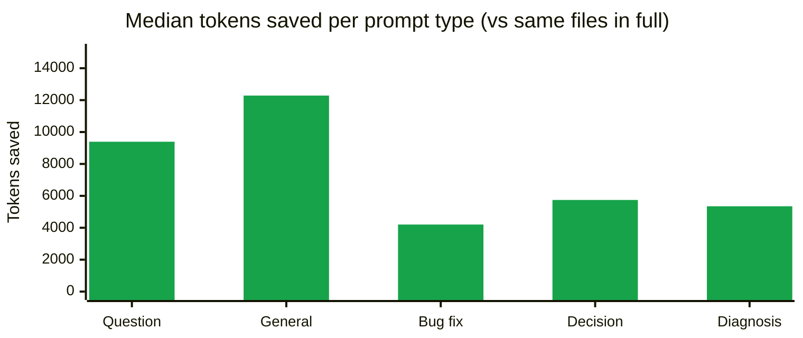

# Token Ops

Token Ops reduces wasted context during AI coding sessions. It gives Cursor, Claude Code, Codex, and other MCP-compatible agents a compact task-focused context pack before they read broadly, then records an estimated saved-token report.

The product goal is simple: install once, vibe code normally, and see how much context the agent avoided.

## Measured Savings

This README, the v0.4.x release series, and the Cursor Marketplace submission package were all built in a single Claude Code session with the Token Ops `UserPromptSubmit` hook enabled in aggressive mode. The numbers below are computed from that session's `.token-ops/session.jsonl` by [`docs/session-stats.mjs`](docs/session-stats.mjs) — a zero-dependency script you can rerun against your own log.

Token Ops generated **~71,000 tokens of packs** in place of **~288,000 tokens of would-be full reads of the same ranked files** — **~217,000 tokens avoided**, equivalent to **~$0.65 Sonnet 4.5** or **~$3.25 Opus 4.7** input cost at list prices.

### By prompt type

Prompt content is not disclosed — only the type of work each prompt represented. All numbers compare the generated pack against reading the same ranked files in full.



| Prompt type | Median pack | Median saved |
|---|---|---|
| Question / clarification | ~2,967 tokens | ~9,392 tokens |
| General comments / feedback | ~3,789 tokens | ~12,285 tokens |
| Bug fix / task request | ~906 tokens | ~4,202 tokens |
| Decision / verification | ~2,032 tokens | ~5,742 tokens |
| Diagnosis (pasted log) | ~2,926 tokens | ~5,348 tokens |

A raw verbatim pack output is checked in at [docs/sample-pack.md](docs/sample-pack.md) so you can see exactly what Token Ops produces.

### What this measures (and what it doesn't)

- **Saved** here means `(tokens of fully reading the ranked relevant files) − (tokens of the generated pack)`. It is the most directly comparable metric: it answers "if the agent had `Read` the same files Token Ops selected, instead of receiving snippets, how many more tokens of input would it have used?"
- These numbers do **not** include tokens the agent reads in follow-up tool calls after receiving the pack. Token Ops front-loads relevant context; it does not prevent further reads when the snippets are insufficient. Real-world savings are at most the figures above and typically smaller.
- Pack and file token counts are estimates: `length / 4` for ASCII and `length / 1.5` for CJK characters, summed. BPE tokenizers split CJK more aggressively than ASCII, so a single ratio underestimates Japanese-heavy content.
- Per-type medians come from a small sample in a single session — treat them as ballpark sketches, not statistics. The aggregate (~217K tokens, ~$0.65 Sonnet) is the more stable number.

### Verify on your own session

After installing the hook (`token-ops install claude-hook --trigger-mode aggressive`) and using Claude Code for a while, run:

```sh
node /path/to/token-ops/docs/session-stats.mjs
```

inside your project. It emits the same table from your own `.token-ops/session.jsonl`. No dependencies, Node 18+.

## Beginner Defaults

Token Ops is designed to be useful without setup:

- No API key
- No account
- No cloud backend
- No telemetry by default
- Local MCP server
- Beginner defaults: 6 files, 80 snippet lines per file, auto language

## Cursor Plugin

Token Ops is being shaped for Cursor Marketplace distribution as a free local plugin.

The plugin includes:

- A local MCP server: `mcp/server.js`
- Cursor rules: `rules/token-ops.mdc`
- A Token Ops skill: `skills/token-ops/SKILL.md`
- Commands for compact context and saved-token reports

The MCP server runs locally. It does not require a hosted backend or a Token Ops account.

After installation, users can ask Cursor:

```text
Show my Token Ops savings report.
```

```text
Use Token Ops before changing this code.
```

```text
Which files are expensive for Cursor to read?
```

## MCP Tools

- `build_compact_context`: create a small task-focused context pack
- `estimate_context_cost`: estimate selected-file and whole-repo context cost
- `list_high_cost_files`: find tracked files that are expensive to put in context
- `report_saved_tokens`: show the local saved-token report

## Levels of Automation

Token Ops can run anywhere from "type a command every time" to "fires on every prompt automatically." Pick the level that matches the editor you use and how much per-project setup you want.

| Level | Editor | Setup | What happens per prompt |
|---|---|---|---|
| **★★★★ Pre-injection** | Claude Code | `token-ops install claude-hook` (once per project) | A `UserPromptSubmit` hook **physically prepends** a compact pack to every prompt. Strongest guarantee — works even if the model would otherwise ignore the tool. Add `--trigger-mode aggressive` to fire on every prompt (≥ 6 chars, non self-referential); the default `smart` only fires on coding-keyword prompts. |
| **★★★ One-click plugin** | Cursor (Marketplace) | One-click install once Token Ops is published to <https://cursor.com/marketplace> | Plugin bundles MCP server + `alwaysApply: true` rule. Agent is told to call `build_compact_context` first on every task. |
| **★★ Global rule** | Cursor (any version) | Paste the rule below into `Cursor Settings → Rules → User Rules` once | Same agent-side instruction as the plugin path, applies to every project without per-project install. |
| **★ Per-project rule** | Cursor | `token-ops install cursor` inside each project | Same rule, scoped to that project's `.cursor/rules/token-ops.mdc`. Use when you don't want a global default. |
| **Manual** | Any editor | None | Type `Use build_compact_context for: <task>` in chat each time. Fine for trying things out. |

### Picking a level

- **You only use Claude Code** → Level ★★★★. Strongest, simplest.
- **You only use Cursor** → Wait for ★★★ Marketplace install (one click), or do ★★ now (paste once).
- **Mixed editors** → ★★★★ for Claude Code, ★★ for Cursor.
- **One-off trial in a single repo** → Manual or ★.

### Global Cursor rule (copy-paste)

For Level ★★, paste this into `Cursor Settings → Rules → User Rules`:

```
Before broad repository exploration, large file reads, or noisy test-log analysis, use Token Ops if its MCP tools are available.

Prefer this order:
1. Call build_compact_context for the current task.
2. Use the returned snippets and token budget before reading more files.
3. Call list_high_cost_files before opening large files, generated files, lockfiles, or logs.
4. Call report_saved_tokens when the user asks about cost, tokens, usage, or savings.

Avoid reading broad repository context until Token Ops output is insufficient for the task.
```

And add Token Ops as an MCP server in `~/.cursor/mcp.json` (one time):

```json
{
  "mcpServers": {
    "token-ops": {
      "command": "/absolute/path/to/node",
      "args": ["/absolute/path/to/token-ops/mcp/server.js"]
    }
  }
}
```

> Use an absolute path to `node` — Cursor GUI subprocesses do not inherit nvm's `PATH`.

## CLI Install

From this repository:

```sh
npm install -g .
```

Or run without installing:

```sh
npx . pack "Fix the CSV import bug"
```

## CLI Usage

Inside any git project:

```sh
token-ops pack "Fix the CSV import bug"
```

Write the pack to a file:

```sh
token-ops pack "Improve auth error handling" -o context-pack.md
```

Show the saved-token report:

```sh
token-ops report
```

Find large tracked text files:

```sh
token-ops high-cost-files --limit 12
```

Estimate context cost for a task:

```sh
token-ops cost "Add tests for billing webhooks"
```

## One-command Editor Setup

Install project-local helpers:

```sh
token-ops install
```

This creates:

- `.claude/skills/token-ops/SKILL.md`
- `.claude/settings.local.json`
- `.cursor/rules/token-ops.mdc`
- `AGENTS.md`

Install only one integration:

```sh
token-ops install claude
token-ops install claude-hook
token-ops install cursor
token-ops install codex
```

Remove the helpers if you want to clean up:

```sh
token-ops uninstall
```

`uninstall` is non-destructive: it only removes the files and JSON keys
Token Ops added. Unrelated `.claude/settings.local.json` entries,
`AGENTS.md` content, and `.cursor/rules` files are preserved.

## Local MCP Server

For advanced users who want to wire Token Ops manually:

```sh
token-ops-mcp
```

The package also exposes the server at:

```sh
node mcp/server.js
```

Cursor-compatible local MCP template:

```json
{
  "mcpServers": {
    "token-ops": {
      "command": "node",
      "args": ["${workspaceFolder}/mcp/server.js"]
    }
  }
}
```

## What It Includes

Each context pack includes:

- Git branch and changed files
- Relevant files selected from task keywords
- Snippets around keyword matches
- Rough token estimates
- Estimated saved tokens versus selected full files and whole-repo context

## Roadmap

- Cursor Marketplace review metadata
- One-click Cursor installation flow
- Pre-read guard policies for generated files, lockfiles, and logs
- Code graph and impact analysis inspired by trace-mcp
- Multi-agent savings reports across Cursor, Codex, and Claude Code
