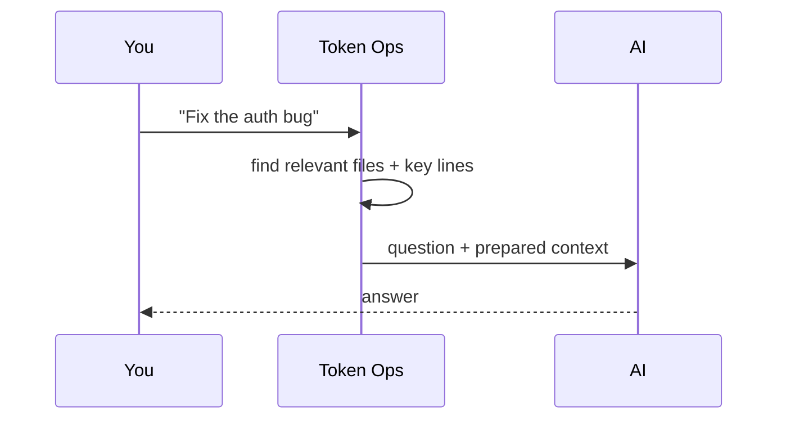
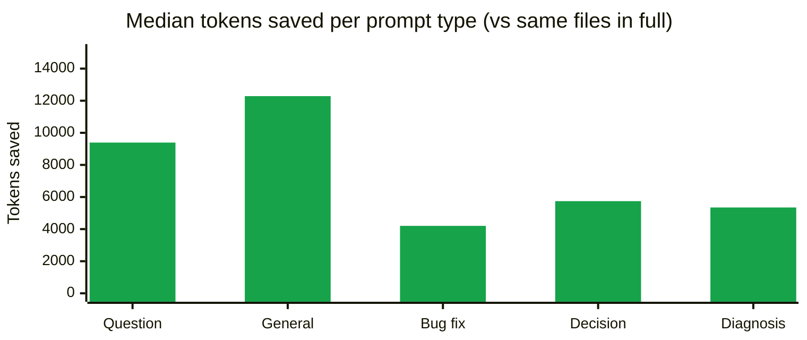

# Token Ops

**日本語**: [README.ja.md](README.ja.md)

Token Ops reduces wasted context during AI coding sessions. It gives Cursor, Claude Code, Codex, and other MCP-compatible agents a compact task-focused context pack before they read broadly, then records an estimated saved-token report.

Install once, code normally, see how much the agent avoided reading. No API key, no account, no cloud backend, no telemetry by default.

## How it works

When you ask an AI assistant about your code, it usually has to dig around your repo first — opening files, searching for keywords, reading more — before it can answer. That digging eats tokens.

Token Ops does the digging up front. Every time you send a question:

1. It looks at your project files
2. Picks the ones most likely to matter for your question
3. Pulls out just the relevant lines

Then it hands those to the AI together with your question. The AI gets what it needs from the start — no wandering.



Same answer quality, fewer tokens. The AI can still read more files if the pack isn't enough.

## Measured Savings

Example:


- Total tokens across this project's history: **~288,000 → ~71,000** (4× smaller)
- Saved: **~217,000 tokens** ≈ **$0.65 (Sonnet 4.5)** / **$3.25 (Opus 4.7)**

### By prompt type

Savings broken down by the kind of prompt (prompt content not disclosed).



| Prompt type | Median pack | Median saved |
|---|---|---|
| Question / clarification | ~2,967 tokens | ~9,392 tokens |
| General comments / feedback | ~3,789 tokens | ~12,285 tokens |
| Bug fix / task request | ~906 tokens | ~4,202 tokens |
| Decision / verification | ~2,032 tokens | ~5,742 tokens |
| Diagnosis (pasted log) | ~2,926 tokens | ~5,348 tokens |

A raw verbatim pack output is checked in at [docs/sample-pack.md](docs/sample-pack.md) so you can see exactly what Token Ops produces.

### What these numbers measure

- **Upper bound, not guaranteed savings.** The AI might still read more files after the pack arrives. Real savings will be at most the figures above, often less.
- **Rough estimates.** Token counts are approximated from character length. Per-prompt-type figures come from a small sample — trust the aggregate more than the breakdown.
- **Quality is preserved.** Token Ops only *adds* context to the conversation. The AI keeps all its tools, so it can read more files when the pack doesn't cover everything.

## Quick Start

> 💡 **Easiest: ask your AI.** Paste this in Claude Code, Cursor, or any AI tool with shell access:
> `Install Token Ops in this project: https://github.com/maikoo811/token-ops`
>
> The AI reads this README and runs the install for you. Follow the manual steps below if that doesn't work.

### 1. Install the CLI

```sh
npm install -g token-ops
```

### 2. Wire Token Ops into your project

```sh
cd /path/to/your-project
token-ops install
```

Default installs hooks/rules for Claude Code, Cursor, and Codex. To install only one:

- `token-ops install claude-hook` — Claude Code hook
- `token-ops install cursor` — Cursor rule
- `token-ops install codex` — Codex `AGENTS.md`

Add `--trigger-mode aggressive` to `claude-hook` to fire on any prompt ≥ 6 chars (default requires a coding keyword).

### Install globally (optional)

Add `--global` to install user-wide (writes to `~/.claude/`, `~/.cursor/`). Token Ops then fires in every project, no per-project install needed.

```sh
token-ops install --global
token-ops install claude-hook --global
```

Codex (AGENTS.md) is project-only. Cursor User Rules require a manual paste — the command prints the text to copy.

### 3. Restart your editor

Claude Code, Cursor, and similar editors read hook / MCP configuration at startup. Quit (`Cmd+Q` on macOS) and reopen the project.

### 4. Verify it's working

Use your editor normally. After a few coding-action prompts (`fix...`, `refactor...`, `バグ...`, etc.), run:

```sh
token-ops report
```

`Runs: N` with N > 0 means it's firing.


### Remove later

```sh
token-ops uninstall
token-ops uninstall --global
```

Removes only what `install` added; unrelated settings are preserved.

## Detailed savings breakdown

`token-ops report` (covered in Verify above) gives the aggregate numbers. For a per-prompt-type breakdown (and an approximate USD cost saved at Claude API list prices), run:

```sh
node /path/to/token-ops/docs/session-stats.mjs
```

Sample output:

```
## Aggregate

- Hook firings: 35
- Generated packs: ~97,000 tokens
- Equivalent full reads of the same ranked files: ~406,000 tokens
- Avoided: ~309,000 tokens
- Approx Sonnet 4.5 input cost saved: ~$0.93
- Approx Opus 4.7 input cost saved: ~$4.63

## By prompt type (median per firing)
| Prompt type | Median pack | Median saved |
|---|---|---|
| Question / clarification | ~2,967 tokens | ~9,392 tokens |
| ... |
```

The script is zero-dependency Node 18+. It filters known test-fixture prompts (so `npm test` runs don't pollute your aggregate) and writes nothing — read-only.

## Reference

### Levels of Automation

Pick by editor and how much setup you want:

| Level | Editor | Setup | What happens per prompt |
|---|---|---|---|
| **★★★★ Pre-injection** | Claude Code | `token-ops install claude-hook` | A hook prepends a compact pack to every prompt. Works even if the model would skip the tool. |
| **★★★ One-click plugin** | Cursor (Marketplace) | One click (once published) | Agent is told to call `build_compact_context` first. |
| **★★ Global rule** | Cursor | Paste the rule into `Settings → Rules → User Rules` | Same as ★★★ but rule-based, applies to every project. |
| **★ Per-project rule** | Cursor | `token-ops install cursor` | Same as ★★ but scoped to one project. |
| **Manual** | Any | None | Type `Use build_compact_context for: <task>` in chat. |

### Cursor Plugin

On the [Cursor Marketplace](https://cursor.com/marketplace). Includes the MCP server, a rule that calls `build_compact_context` first, and the four MCP tools below.

### MCP Tools

- `build_compact_context`: create a small task-focused context pack
- `estimate_context_cost`: estimate selected-file and whole-repo context cost
- `list_high_cost_files`: find tracked files that are expensive to put in context
- `report_saved_tokens`: show the local saved-token report

### Global Cursor rule (copy-paste)

For Level ★★, paste this into `Cursor Settings → Rules → User Rules`:

```
Before broad repository exploration, large file reads, or noisy test-log analysis, use Token Ops if its MCP tools are available.

Prefer this order:
1. Call build_compact_context for the current task.
2. Use the returned snippets and token budget before reading more files.
3. Call list_high_cost_files before opening large files, generated files, lockfiles, or logs.
4. Call report_saved_tokens when the user asks about cost, tokens, usage, or savings.

Avoid reading broad repository context until Token Ops output is insufficient for the task.
```

And add Token Ops as an MCP server in `~/.cursor/mcp.json` (one time):

```json
{
  "mcpServers": {
    "token-ops": {
      "command": "/absolute/path/to/node",
      "args": ["/absolute/path/to/token-ops/mcp/server.js"]
    }
  }
}
```

> Use an absolute path to `node` — Cursor GUI subprocesses do not inherit nvm's `PATH`.

## Advanced

<details>
<summary>Wire the MCP server manually</summary>

For users who want to register Token Ops without going through `token-ops install`:

```sh
token-ops-mcp
```

Or run the server file directly:

```sh
node mcp/server.js
```

Cursor-compatible local MCP template:

```json
{
  "mcpServers": {
    "token-ops": {
      "command": "node",
      "args": ["${workspaceFolder}/mcp/server.js"]
    }
  }
}
```

> Prefer an absolute path to the `node` binary if you use nvm — Cursor GUI subprocesses don't inherit shell `PATH`.

</details>

## Roadmap

- Cursor Marketplace review metadata
- One-click Cursor installation flow
- Pre-read guard policies for generated files, lockfiles, and logs
- Code graph and impact analysis inspired by trace-mcp
- Multi-agent savings reports across Cursor, Codex, and Claude Code
